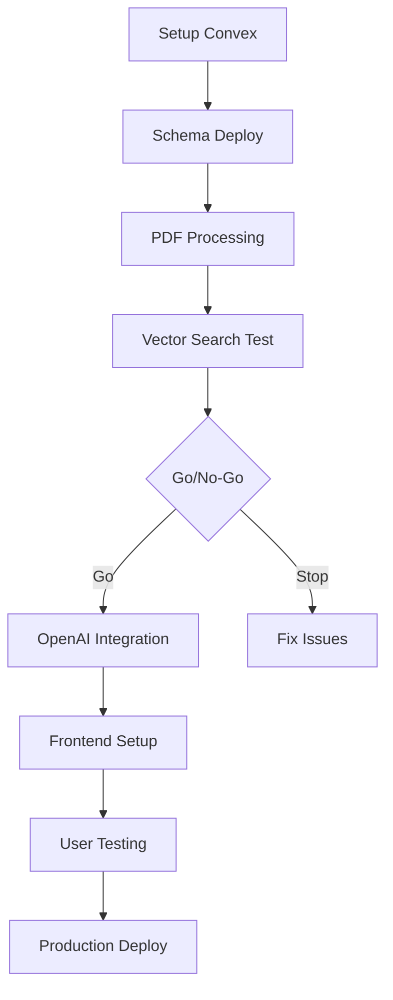

# Plan de Implementación Ejecutable - Chatbot Político MVP

**Proyecto**: Sistema de consulta inteligente sobre programas presidenciales chilenos  
**Stack**: Next.js 14 + Convex + assistant-ui + OpenAI  
**Documento creado**: Agosto 2025  

---

## Resumen Ejecutivo

### ✅ Validación del PDR
- **Stack técnico sólido**: Convex + assistant-ui son production-ready
- **Riesgo principal identificado**: Procesamiento de PDFs con mitigaciones claras
- **Scope claro**: Solo consultas y comparaciones, sin features extras

### 🎯 Approach Estratégico
- **Week 1 es crítica**: Validar procesamiento PDFs con 1-2 PDFs antes de escalar a 7
- **Validación iterativa**: Checkpoint en cada paso antes de continuar
- **Go/No-Go decisions**: Criterios claros para determinar si continuar o ajustar

### 📊 Success Metrics MVP
- Procesar 7+ programas presidenciales exitosamente
- >85% precisión en respuestas (validadas manualmente)
- Comparaciones multi-candidato funcionales
- Interfaz usable para cualquier persona (incluye abuelas)

---

## Estructura Completa del Proyecto

```
chatbot-politico/
├── app/                          # Next.js 14 app directory
│   ├── layout.tsx                # Root layout con providers
│   ├── page.tsx                  # Chat interface principal
│   ├── globals.css               # Estilos globales
│   └── api/                      # API routes (si necesario)
│       └── health/
│           └── route.ts          # Health check endpoint
├── convex/                       # Convex backend completo
│   ├── _generated/              # Auto-generados por Convex
│   ├── schema.ts                # Database schema con vector index
│   ├── queries.ts               # Vector search functions
│   ├── mutations.ts             # Data ingestion endpoints
│   ├── aiChat.ts                # OpenAI integration
│   └── lib/                     # Utilidades del backend
│       ├── openai.ts           # OpenAI client config
│       └── utils.ts            # Helper functions
├── components/                   # UI components
│   ├── ChatInterface.tsx        # Componente principal del chat
│   ├── MessageBubble.tsx        # Componente individual de mensaje
│   ├── SourceCitation.tsx       # Componente para citas
│   └── ui/                      # shadcn/ui components
│       ├── button.tsx
│       ├── input.tsx
│       ├── card.tsx
│       └── loading.tsx
├── lib/                         # Frontend utilities
│   ├── utils.ts                 # Utilidades generales
│   ├── constants.ts             # Constantes de la app
│   └── types.ts                 # TypeScript types
├── scripts/                     # PDF processing pipeline
│   ├── process_pdfs.py          # Script principal de procesamiento
│   ├── test_extraction.py       # Testing de extracción
│   ├── test_embeddings.py       # Testing de embeddings
│   ├── test_upload.py           # Testing de upload a Convex
│   ├── requirements.txt         # Python dependencies
│   ├── config.py               # Configuración del script
│   └── pdfs/                   # Raw PDFs folder
│       ├── kast_programa.pdf
│       ├── jara_programa.pdf
│       ├── sichel_programa.pdf
│       ├── boric_programa.pdf
│       ├── parisi_programa.pdf
│       ├── artés_programa.pdf
│       └── provoste_programa.pdf
├── tests/                       # Testing suite
│   ├── validate_week1.sh       # Week 1 validation
│   ├── validate_week2.sh       # Week 2 validation
│   ├── health_check.sh         # Production health check
│   └── e2e/                    # End-to-end tests
│       └── chat.spec.ts
├── docs/                        # Documentación
│   ├── plan-implementacion-mvp.md  # Este documento
│   ├── pdr-chatbot-politico.md     # PDR original
│   └── deployment-guide.md         # Guía de deployment
├── .env.local.example          # Template de variables de entorno
├── package.json                # Dependencies y scripts
├── convex.json                 # Configuración de Convex
├── next.config.js              # Configuración de Next.js
├── tailwind.config.js          # Configuración de Tailwind
├── tsconfig.json               # TypeScript config
└── README.md                   # Instrucciones básicas del proyecto
```

---

Esto deja **Python solo para la ingesta** y **Convex como backend persistente + API**.
El frontend ya no depende de tu script, sino solo de Convex.

---


* Hacer **todo el pipeline en Python localmente** (OCR → chunks → embeddings → index),
* vs. usar Convex como backend y **subir ahí los datos ya procesados**.

Déjame ordenar el análisis:

---

##  ¿Convex puede recibir embeddings “ya hechos”?

Sí . Convex no genera embeddings por sí mismo. Lo que hace es:

* Guardar tus documentos/chunks en su base,
* Guardar los **vectores de embeddings** en un campo especial,
* Crear un `vectorIndex` sobre esos embeddings,
* Permitir búsquedas semánticas (`vectorSearch`) con filtros (por `doc_id`, `tema`, etc).

 Eso significa que tú **puedes crear los embeddings en Python** (como ya haces con OpenAI o con un modelo local tipo `bge-m3`) y luego subirlos a Convex vía **API o SDK**.

---

##  SDKs de Convex

Convex está pensado para **TypeScript / JavaScript** como primera clase.

* **SDK oficial**: [`convex/browser`](https://docs.convex.dev/using/quickstart) y [`convex/react`](https://docs.convex.dev/react).
* Para Python: **no hay SDK oficial directo**.

  * Pero puedes hablar con la API de Convex (es HTTP JSON), o
  * Hacer un micro-backend en Node que reciba tus datos desde Python y los inserte en Convex.

En resumen:

* **Python → embeddings/chunks → POST JSON → Convex API (TS)**.
* Luego tu frontend web consulta a Convex directamente.

---

 Te hago un diagrama de alto nivel con las piezas y el flujo.

---

## 🏗️ Arquitectura propuesta

```
                ┌────────────────────────┐
                │        Usuario          │
                │  (Chat Web / Frontend)  │
                └───────────┬────────────┘
                            │
                            ▼
                 ┌────────────────────┐
                 │   Frontend (React) │
                 │   o Cliente Web    │
                 └───────────┬────────┘
                             │ pregunta
                             ▼
                 ┌────────────────────┐
                 │      Convex API    │
                 │ (actions, queries) │
                 └───────────┬────────┘
                             │
          ┌──────────────────┼──────────────────┐
          │                  │                  │
          ▼                  ▼                  ▼
┌───────────────────┐ ┌──────────────────┐ ┌────────────────────┐
│ Base de Chunks    │ │ Vector Index      │ │ Función embeddings │
│ (texto, doc_id,   │ │ (sobre embeddings │ │ (OpenAI o local)   │
│ page, metadata)   │ │ de cada chunk)    │ │ para preguntas)    │
└───────────────────┘ └──────────────────┘ └────────────────────┘

```

---

## 📥 Ingesta de documentos (hecho en Python)

```
PDFs (programas políticos)
       │
       ▼
 ┌───────────────┐
 │ Pipeline Py   │
 │ OCR + Limpieza│
 │ Chunking      │
 │ Embeddings    │
 └──────┬────────┘
        │ (JSON con chunks+embeddings)
        ▼
 ┌──────────────────┐
 │   Convex Action   │
 │  (insert chunks)  │
 └──────────────────┘
```

---

## 🔄 Consulta del usuario (chat)

1. Usuario pregunta en el frontend.
2. Convex recibe la pregunta:

   * Genera embedding de la pregunta.
   * Busca en el **vector index**.
   * Devuelve los chunks más relevantes.
3. Esos chunks + la pregunta se mandan al **modelo de lenguaje (chat)**.
4. El modelo responde con texto + referencias.
5. Respuesta vuelve al frontend.

---


## ⚙️ Flujo recomendado para tu MVP

1. **Ingesta en Python** (lo que ya tienes):

   * Abrir PDF → OCR si hace falta → limpieza → chunking → generar embeddings.
   * Obtienes:

     ```json
     {
       "doc_id": "kast",
       "page": 34,
       "text": "El programa propone un sistema mixto de pensiones...",
       "embedding": [0.123, -0.045, ...]
     }
     ```

2. **Carga a Convex**

   * Llamas a un endpoint/action en Convex que inserta esos objetos en la tabla `chunks`.
   * Cada fila: `doc_id`, `page`, `text`, `embedding`.
   * Convex crea un `vectorIndex` sobre `embedding`.

3. **Consulta desde frontend web (chat)**

   * Usuario pregunta → Convex action genera embedding de la pregunta (puede ser OpenAI o local en el servidor).
   * Convex hace `vectorSearch` y devuelve los top-K chunks.
   * Frontend pasa esos chunks + pregunta al modelo de lenguaje (chat).

---

## 📝 Respuesta a tu duda

* **Convex NO analiza chunks por sí mismo** → necesita que tú le subas los embeddings listos.
* **Sí puedes procesar todo en Python como ahora** y luego subir chunks + embeddings a Convex.
* **Consumo web/chat**: lo harías desde Convex (con vectorSearch) y/o desde tu backend (que a su vez consulta Convex).

---

👉 En otras palabras:

* **Python** queda como tu **pipeline de ingesta** (ETL de PDFs → embeddings).
* **Convex** queda como tu **almacén de chunks + embeddings** y la API que tu chat va a consumir.

---

¿Quieres que te dibuje un **diagrama del flujo arquitectónico** con estos pasos (Python → Convex → Chat Web), para que quede claro cómo encajan todas las piezas?


## Plan Semanal Detallado

## Día 1: Python Processing Setup
**Objetivos**: Entorno Python listo, test con 1 PDF  
**Prioridad**: 🔥 CRÍTICO  
**Usar como base**: `rag_pdf_kit/rag_pdf_kit.py`
### Tareas Específicas
1. **Setup Python environment**
   ```bash
   cd scripts
   python -m venv venv
   source venv/bin/activate  # Windows: venv\Scripts\activate
   ```

2. **Crear `scripts/requirements.txt`**
   ```
   pymupdf4llm==0.0.9
   openai==1.12.0  
   python-dotenv==1.0.0
   requests==2.31.0
   tiktoken==0.5.2
   numpy==1.24.3
   ```

3. **Instalar dependencies**
   ```bash
   pip install -r requirements.txt
   ```

4. **Descargar 1 PDF de prueba**
   - Buscar programa presidencial de Kast 2021-2022
   - Guardar como `scripts/pdfs/kast_programa.pdf`
   - Verificar que es legible (abrir manualmente)

5. **Crear `scripts/config.py`**
   ```python
   import os
   from dotenv import load_dotenv
   
   load_dotenv()
   
   OPENAI_API_KEY = os.getenv("OPENAI_API_KEY")
   CONVEX_URL = os.getenv("CONVEX_URL") 
   CHUNK_SIZE = 1000  # tokens
   CHUNK_OVERLAP = 200  # tokens
   EMBEDDING_MODEL = "text-embedding-3-small"
   ```

6. **Crear `scripts/process_pdfs.py` básico**
   ```python
   import pymupdf4llm
   import openai
   import tiktoken
   from config import *
   
   def extract_text_from_pdf(pdf_path):
       """Extract text maintaining structure"""
       md_text = pymupdf4llm.to_markdown(pdf_path)
       return md_text
   
   def chunk_text(text, candidate_name):
       """Split text into chunks with metadata"""
       # Implementar chunking básico
       chunks = []
       # ... lógica de chunking
       return chunks
   
   def test_single_pdf():
       pdf_path = "pdfs/kast_programa.pdf"
       print(f"Processing {pdf_path}...")
       
       # Extract
       text = extract_text_from_pdf(pdf_path)
       print(f"Extracted {len(text)} characters")
       
       # Chunk
       chunks = chunk_text(text, "José Antonio Kast")
       print(f"Generated {len(chunks)} chunks")
       
       return chunks
   
   if __name__ == "__main__":
       test_single_pdf()
   ```

7. **Test extracción completa**
   ```bash
   python process_pdfs.py
   ```

### ✅ Checkpoint de Validación
- ✅ pymupdf4llm extrae texto limpio del PDF (sin caracteres raros)
- ✅ Chunking genera 20-50 chunks coherentes
- ✅ Cada chunk tiene entre 800-1200 tokens
- ✅ Texto extraído es >80% coherente al verificar manualmente

### ❌ Criterios de Stop
- PDF no se puede procesar (archivo corrupto)
- Texto extraído es <50% coherente
- Chunking genera <10 chunks o chunks sin sentido

**Si extracción <80% coherente → STOP y cambiar a OCR con Tesseract**
---

# SEMANA 2: Procesamiento de Documentos (CRÍTICO)

## Día 2: Setup Foundation
**Objetivos**: Convex + Next.js funcionando, schema deployed  
**Tiempo estimado**: 4 horas  
**Prioridad**: 🔥 CRÍTICO  

### Tareas Específicas
1. **Crear proyecto Next.js**
   ```bash
   npx create-next-app@latest chatbot-politico --typescript --tailwind --app
   cd chatbot-politico
   ```

2. **Setup Convex**
   ```bash
   npx convex init
   # Seguir wizard de configuración
   ```

3. **Crear schema en `convex/schema.ts`**
   ```typescript
   import { defineSchema, defineTable } from "convex/server";
   import { v } from "convex/values";
   
   export default defineSchema({
     chunks: defineTable({
       candidate: v.string(),
       section: v.string(),
       subsection: v.optional(v.string()),
       content: v.string(),
       page_number: v.number(),
       token_count: v.number(),
       keywords: v.array(v.string()),
       importance_score: v.number(),
       document_title: v.string(),
       embedding: v.array(v.number()), // 1536 dimensions
     }).vectorIndex("by_content", {
       vectorField: "embedding",
       dimensions: 1536,
       filterFields: ["candidate", "section"]
     }),
   
     conversations: defineTable({
       query: v.string(),
       response: v.string(),
       sources: v.array(v.string()),
       response_time_ms: v.number(),
       created_at: v.number(),
     })
   });
   ```

4. **Deploy schema inicial**
   ```bash
   npx convex deploy
   ```

5. **Verificar en Convex Dashboard**
   - Abrir dashboard desde terminal output
   - Confirmar schema deployed
   - Verificar vector index creado

### ✅ Checkpoint de Validación
- ✅ Convex dashboard muestra proyecto activo
- ✅ Schema deployed sin errores  
- ✅ Vector index "by_content" visible en dashboard
- ✅ Next.js app arranca en localhost:3000

### ❌ Criterios de Stop
- Schema deployment falla
- Vector index no se crea automáticamente  
- Errores de conexión a Convex

**Si falla → STOP y resolver antes de continuar**


---

## Día 3: Convex Integration + Upload
**Objetivos**: Script completo sube chunks a Convex  
**Tiempo estimado**: 8 horas  
**Prioridad**: 🔥 CRÍTICO  

### Tareas Específicas
1. **Completar `scripts/process_pdfs.py` con embeddings**
   ```python
   def generate_embeddings(chunks):
       """Generate OpenAI embeddings for chunks"""
       client = openai.OpenAI(api_key=OPENAI_API_KEY)
       
       for chunk in chunks:
           response = client.embeddings.create(
               model=EMBEDDING_MODEL,
               input=chunk["content"]
           )
           chunk["embedding"] = response.data[0].embedding
       
       return chunks
   ```

2. **Crear `convex/mutations.ts`**
   ```typescript
   import { mutation } from "./_generated/server";
   import { v } from "convex/values";
   
   export const insertChunk = mutation({
     args: {
       candidate: v.string(),
       section: v.string(),
       content: v.string(),
       page_number: v.number(),
       token_count: v.number(),
       keywords: v.array(v.string()),
       importance_score: v.number(),
       document_title: v.string(),
       embedding: v.array(v.number()),
     },
     handler: async (ctx, args) => {
       return await ctx.db.insert("chunks", args);
     },
   });
   ```

3. **HTTP Upload en `process_pdfs.py`**
   ```python
   import requests
   
   def upload_to_convex(chunks):
       """Upload chunks to Convex via HTTP"""
       for chunk in chunks:
           response = requests.post(
               f"{CONVEX_URL}/api/insertChunk",
               json=chunk
           )
           if response.status_code != 200:
               print(f"Failed to upload chunk: {response.text}")
           else:
               print(f"Uploaded chunk successfully")
   ```

4. **Test upload completo**
   ```bash
   python process_pdfs.py
   ```

5. **Verificar en Convex Dashboard**
   - Ver chunks en tabla "chunks"
   - Verificar embeddings están poblados
   - Verificar metadata completa

### ✅ Checkpoint de Validación
- ✅ 20-50 chunks aparecen en Convex database
- ✅ Cada chunk tiene embedding de 1536 dimensiones
- ✅ Metadata completa (candidato, sección, página)
- ✅ No errores en upload process

### ❌ Criterios de Stop
- Upload falla consistentemente
- Embeddings no se generan (error de OpenAI API)
- Chunks aparecen sin metadata

**Si upload falla → STOP y debuggear HTTP connection**

---

## Día 4: Scale to All PDFs  
**Objetivos**: Procesar los 7 PDFs completos  
**Tiempo estimado**: 6 horas  
**Prioridad**: 🔥 CRÍTICO  

### Tareas Específicas
1. **Descargar restantes 6 PDFs**
   - Gabriel Boric (Apruebo Dignidad 2021)
   - Sebastián Sichel (Chile Podemos Más 2021)  
   - Franco Parisi (Partido de la Gente 2021)
   - Marco Enríquez-Ominami (PRO 2021)
   - Yasna Provoste (Nuevo Pacto Social 2021)
   - Eduardo Artés (Unión Patriótica 2021)
   
   Guardar en `scripts/pdfs/` con nombres consistentes

2. **Actualizar `process_pdfs.py` para batch processing**
   ```python
   def process_all_pdfs():
       pdf_configs = [
           {"file": "kast_programa.pdf", "candidate": "José Antonio Kast"},
           {"file": "boric_programa.pdf", "candidate": "Gabriel Boric"},
           {"file": "sichel_programa.pdf", "candidate": "Sebastián Sichel"},
           # ... resto de candidatos
       ]
       
       for config in pdf_configs:
           try:
               print(f"Processing {config['candidate']}...")
               process_single_pdf(config["file"], config["candidate"])
           except Exception as e:
               print(f"ERROR processing {config['candidate']}: {e}")
               # Log pero continuar con otros PDFs
   ```

3. **Ejecutar procesamiento completo**
   ```bash
   python process_pdfs.py --batch
   ```

4. **Monitorear proceso**
   - Tracking de progreso por candidato
   - Log de errores específicos  
   - Tiempo estimado de completion

5. **Validar resultados en Convex**
   - Verificar ~500-1000 chunks totales
   - Confirmar distribución por candidato
   - Test queries básicas

### ✅ Checkpoint de Validación
- ✅ Al menos 5/7 PDFs procesados exitosamente
- ✅ Total chunks entre 500-1000 en database
- ✅ Distribución razonable por candidato (50-150 chunks c/u)
- ✅ No más de 2 PDFs fallaron completamente

### ❌ Criterios de Stop
- <5 PDFs procesados exitosamente
- <300 chunks totales en database
- Errores sistemáticos en embeddings

**Si <5 PDFs procesados → STOP y resolver extracción**

---

## Día 5: Query Validation
**Objetivos**: Validar calidad de búsquedas  
**Tiempo estimado**: 4 horas  
**Prioridad**: 🔥 CRÍTICO  

### Tareas Específicas
1. **Crear `convex/queries.ts`**
   ```typescript
   import { query } from "./_generated/server";
   import { v } from "convex/values";
   
   export const vectorSearch = query({
     args: {
       searchText: v.string(),
       candidate: v.optional(v.string()),
       limit: v.optional(v.number()),
     },
     handler: async (ctx, args) => {
       // Implementar vector search básico
       const results = await ctx.vectorSearch("chunks", "by_content", {
         vector: await getEmbedding(args.searchText),
         limit: args.limit ?? 5,
         filter: args.candidate ? (q) => q.eq("candidate", args.candidate) : undefined,
       });
       
       return results;
     },
   });
   ```

2. **Test 20+ consultas desde Convex Dashboard**
   Queries de prueba:
   - "¿Qué propone Kast sobre pensiones?"
   - "Políticas económicas de Boric"  
   - "Propuestas de seguridad ciudadana"
   - "Educación superior gratuita"
   - "Impuestos y reforma tributaria"
   - "Salud pública y privada"
   - "Política exterior con países vecinos"
   - "Medio ambiente y cambio climático"
   - "Derechos de la mujer"
   - "Pueblos originarios"

3. **Validar precision manualmente**
   - Cada query debe retornar chunks relevantes
   - Verificar que chunks pertenecen al candidato correcto
   - Confirmar que contenido es pertinente a la consulta

4. **Ajustar filtros si necesario**
   - Por candidato específico
   - Por sección del programa
   - Por relevance score

5. **Test queries multi-candidato**
   - Búsquedas que deberían retornar múltiples candidatos
   - Verificar que no hay bias hacia algún candidato

### ✅ Go/No-Go Decision Point
- ✅ Vector search >80% precision en test queries
- ✅ Multi-candidate searches funcionan correctamente  
- ✅ Response time <2s para búsquedas
- ✅ No bias sistemático hacia algún candidato

### ❌ STOP Proyecto Si:
- <70% precision en queries básicas
- Búsquedas retornan chunks irrelevantes consistentemente
- Problemas técnicos irresolubles con vector search

**Si precision <80% → Ajustar chunking strategy o considerar hybrid search**

---

# SEMANA 2: Backend de Consultas

## Día 1: OpenAI Chat Integration
**Objetivos**: Convex + OpenAI funcionando end-to-end  
**Tiempo estimado**: 6 horas  

### Tareas Específicas
1. **Crear `convex/lib/openai.ts`**
   ```typescript
   import OpenAI from "openai";
   
   const openai = new OpenAI({
     apiKey: process.env.OPENAI_API_KEY,
   });
   
   export async function generateChatResponse(
     query: string,
     context: string[]
   ): Promise<string> {
     const prompt = buildPrompt(query, context);
     
     const response = await openai.chat.completions.create({
       model: "gpt-4o-mini",
       messages: [{ role: "user", content: prompt }],
       temperature: 0.3,
       max_tokens: 1000,
     });
     
     return response.choices[0].message.content || "";
   }
   ```

2. **Crear `convex/aiChat.ts`**
   ```typescript
   import { action } from "./_generated/server";
   import { v } from "convex/values";
   import { vectorSearch } from "./queries";
   import { generateChatResponse } from "./lib/openai";
   
   export const chatWithDocs = action({
     args: { query: v.string() },
     handler: async (ctx, args) => {
       // 1. Vector search para encontrar contexto
       const searchResults = await ctx.runQuery(
         "queries:vectorSearch",
         { searchText: args.query, limit: 5 }
       );
       
       // 2. Assemblar contexto
       const context = searchResults.map(r => r.content);
       
       // 3. Generar respuesta con OpenAI
       const response = await generateChatResponse(args.query, context);
       
       // 4. Log conversation
       await ctx.runMutation("mutations:logConversation", {
         query: args.query,
         response,
         sources: searchResults.map(r => r._id),
       });
       
       return { response, sources: searchResults };
     },
   });
   ```

3. **Implementar context assembly**
   - Top 5 chunks más relevantes
   - Máximo 3000 tokens de contexto
   - Metadata de sources para citación

4. **Test consulta completa**
   ```bash
   # Desde Convex dashboard
   > ctx.runAction("aiChat:chatWithDocs", { query: "¿Qué propone Kast sobre pensiones?" })
   ```

### ✅ Checkpoint
- ✅ Query → search → context → OpenAI funciona end-to-end
- ✅ Respuesta coherente y relevante
- ✅ Sources correctamente identificados
- ✅ Response time <5s

---

## Día 2: Prompt Engineering Optimization
**Objetivos**: Respuestas precisas y bien citadas  
**Tiempo estimado**: 6 horas  

### Tareas Específicas
1. **Implementar prompt del PDR**
   ```typescript
   function buildPrompt(query: string, context: string[]): string {
     return `
   Eres un analista político chileno experto. 
   Responde SOLO basándote en el contexto proporcionado de programas presidenciales.
   Si no tienes información específica, di "No tengo información sobre eso en los programas analizados".
   
   CONTEXTO DE PROGRAMAS PRESIDENCIALES:
   ${context.map((chunk, i) => `[${i+1}] ${chunk}`).join('\n\n')}
   
   CONSULTA: ${query}
   
   INSTRUCCIONES:
   1. Respuesta clara y concisa
   2. Cita fuentes específicas usando [1], [2], etc.
   3. Si es comparación, usa estructura organizada
   4. No inventes información que no esté en el contexto
   `;
   }
   ```

2. **Testing con 30+ consultas variadas**
   - 10 consultas específicas por candidato
   - 10 consultas comparativas
   - 10 consultas temáticas generales

3. **Iteración de prompts para reducir alucinaciones**
   - A/B testing de diferentes approaches
   - Métricas de hallucination rate
   - Optimización de citation format

4. **Implementar confidence scoring**
   ```typescript
   interface ChatResponse {
     response: string;
     confidence: number; // 0.0 - 1.0
     sources: Source[];
     hasInsufficientContext: boolean;
   }
   ```

### ✅ Checkpoint
- ✅ >85% respuestas útiles en test set
- ✅ <10% hallucination rate
- ✅ Citations consistentes y precisas
- ✅ Respuestas apropiadas para "no tengo información"

---

## Día 3: Multi-Candidate Comparison Logic
**Objetivos**: Comparaciones estructuradas funcionando  
**Tiempo estimado**: 6 horas  

### Tareas Específicas
1. **Parallel search function**
   ```typescript
   export const compare候选人 = action({
     args: { 
       query: v.string(),
       candidates: v.array(v.string())
     },
     handler: async (ctx, args) => {
       // Búsquedas paralelas por candidato
       const searchPromises = args.candidates.map(candidate =>
         ctx.runQuery("queries:vectorSearch", {
           searchText: args.query,
           candidate,
           limit: 3
         })
       );
       
       const results = await Promise.all(searchPromises);
       // ... logic para comparative analysis
     }
   });
   ```

2. **Context assembly para comparaciones**
   - Balancear contexto entre candidatos
   - Evitar bias por cantidad de contenido
   - Structured output template

3. **Prompt para comparaciones**
   ```
   Compara las propuestas de los candidatos basándote en el contexto.
   
   Formato de respuesta:
   
   **[Candidato 1]:**
   - [propuesta específica]
   
   **[Candidato 2]:**  
   - [propuesta específica]
   
   **Principales diferencias:**
   - [análisis comparativo]
   ```

4. **Test con 10+ consultas comparativas**
   - "Compara políticas de pensiones de Kast y Boric"
   - "Diferencias en propuestas económicas entre todos los candidatos"
   - "¿Quién propone mejor política de salud?"

### ✅ Checkpoint
- ✅ Comparaciones coherentes con format estructurado
- ✅ Balance equitativo entre candidatos
- ✅ Análisis de diferencias preciso
- ✅ No bias sistemático

---

## Día 4: Error Handling + Edge Cases
**Objetivos**: Sistema robusto para edge cases  
**Tiempo estimado**: 5 horas  

### Tareas Específicas
1. **Handling para queries sin resultados**
   ```typescript
   if (searchResults.length === 0) {
     return {
       response: "No encontré información específica sobre esa consulta en los programas presidenciales analizados.",
       confidence: 0.0,
       sources: [],
       hasInsufficientContext: true
     };
   }
   ```

2. **Rate limiting implementation**
   ```typescript
   // En Convex action
   const rateLimitKey = `user_${getUserId()}_${Date.now()}`;
   // Implementar rate limiting logic
   ```

3. **Input sanitization y validation**
   - Query length limits
   - Malicious input detection
   - Special character handling

4. **Error logging y monitoring**
   - Structured error logging
   - Performance metrics tracking
   - Failed query analysis

5. **Fallback responses**
   - Partial results cuando contexto insuficiente
   - Graceful degradation cuando OpenAI API falla
   - Cache de respuestas populares

### ✅ Checkpoint
- ✅ Sistema maneja gracefully todos los edge cases
- ✅ Error messages user-friendly
- ✅ No crashes con inputs inesperados
- ✅ Logging comprehensivo para debugging

---

## Día 5: Performance + Cost Optimization
**Objetivos**: Sistema optimizado para producción  
**Tiempo estimado**: 5 horas  

### Tareas Específicas
1. **Caching layer para queries similares**
   ```typescript
   const cacheKey = generateCacheKey(query);
   const cached = await getCachedResponse(cacheKey);
   if (cached && !isExpired(cached)) {
     return cached.response;
   }
   ```

2. **Token usage optimization**
   - Context compression para queries similares
   - Smart chunking para reduce token count
   - Batch processing donde sea posible

3. **Response time optimization**
   - Parallel processing donde sea posible
   - Connection pooling para OpenAI
   - Database query optimization

4. **Cost monitoring implementation**
   ```typescript
   interface UsageMetrics {
     tokensUsed: number;
     apiCalls: number;
     estimatedCost: number;
     timestamp: number;
   }
   ```

5. **Load testing con 100+ queries**
   - Concurrent users simulation  
   - Performance under load
   - Memory usage monitoring

### ✅ Checkpoint
- ✅ <$0.05 per query average cost
- ✅ <3s response time p95
- ✅ Sistema estable bajo load
- ✅ Cost monitoring activo

---

# SEMANA 3: Frontend con assistant-ui

## Día 1: Next.js + assistant-ui Setup
**Objetivos**: Chat interface básico funcionando  
**Tiempo estimado**: 6 horas  

### Tareas Específicas
1. **Install assistant-ui dependencies**
   ```bash
   npm install @assistant-ui/react ai lucide-react
   npm install @radix-ui/react-avatar @radix-ui/react-button
   ```

2. **Setup assistant-ui provider en `app/layout.tsx`**
   ```tsx
   import { AssistantRuntimeProvider } from "@assistant-ui/react";
   
   export default function RootLayout({
     children,
   }: {
     children: React.ReactNode;
   }) {
     return (
       <html lang="es">
         <body>
           <AssistantRuntimeProvider>
             {children}
           </AssistantRuntimeProvider>
         </body>
       </html>
     );
   }
   ```

3. **Crear `components/ChatInterface.tsx`**
   ```tsx
   import { Thread } from "@assistant-ui/react";
   import { useConvex } from "convex/react";
   
   export function ChatInterface() {
     const convex = useConvex();
     
     const handleMessage = async (message: string) => {
       return await convex.action("aiChat:chatWithDocs", { query: message });
     };
     
     return (
       <div className="h-screen flex flex-col">
         <Thread 
           onMessage={handleMessage}
           placeholder="Pregunta sobre los programas presidenciales..."
         />
       </div>
     );
   }
   ```

4. **Integración con Convex en `app/page.tsx`**
   ```tsx
   import { ConvexProvider } from "convex/react";
   import { ChatInterface } from "@/components/ChatInterface";
   
   export default function Home() {
     return (
       <ConvexProvider url={process.env.NEXT_PUBLIC_CONVEX_URL!}>
         <ChatInterface />
       </ConvexProvider>
     );
   }
   ```

5. **Test mensaje básico end-to-end**
   ```bash
   npm run dev
   # Enviar mensaje de prueba en la interfaz
   ```

### ✅ Checkpoint
- ✅ Chat interface se renderiza correctamente
- ✅ Mensajes se envían a Convex
- ✅ Respuestas aparecen en el chat
- ✅ No errores de console

---

## Día 2: UI/UX Polish
**Objetivos**: Interface profesional y user-friendly  
**Tiempo estimado**: 6 horas  

### Tareas Específicas
1. **Setup shadcn/ui**
   ```bash
   npx shadcn-ui@latest init
   npx shadcn-ui@latest add button input card avatar
   ```

2. **Styling responsive para mobile/desktop**
   ```tsx
   // Responsive design con Tailwind
   <div className="h-screen max-w-4xl mx-auto p-4 md:p-6">
     {/* Mobile-first approach */}
   </div>
   ```

3. **Loading states y typing indicators**
   ```tsx
   const [isTyping, setIsTyping] = useState(false);
   
   {isTyping && (
     <div className="flex items-center space-x-2">
       <div className="animate-pulse">Escribiendo...</div>
     </div>
   )}
   ```

4. **Message history y persistence**
   - Local storage para conversation history
   - Scroll to bottom en nuevos mensajes
   - Message timestamps

5. **Error states user-friendly**
   ```tsx
   {error && (
     <div className="bg-red-50 border border-red-200 rounded-lg p-4">
       <p className="text-red-800">
         Lo siento, hubo un error. Por favor intenta de nuevo.
       </p>
     </div>
   )}
   ```

### ✅ Checkpoint
- ✅ Interface pulida y profesional
- ✅ Responsive design funciona en mobile/desktop
- ✅ Loading states claros
- ✅ Manejo de errores user-friendly

---

## Día 3: Advanced Chat Features
**Objetivos**: Features avanzadas de chat  
**Tiempo estimado**: 7 horas  

### Tareas Específicas
1. **Markdown rendering para respuestas**
   ```bash
   npm install react-markdown remark-gfm
   ```
   
   ```tsx
   import ReactMarkdown from 'react-markdown';
   
   <ReactMarkdown 
     remarkPlugins={[remarkGfm]}
     className="prose prose-sm max-w-none"
   >
     {message.content}
   </ReactMarkdown>
   ```

2. **Source citations clickable**
   ```tsx
   interface SourceCitation {
     id: string;
     candidate: string;
     section: string;
     page: number;
   }
   
   function CitationBadge({ source }: { source: SourceCitation }) {
     return (
       <button 
         className="inline-flex items-center px-2 py-1 rounded-full text-xs bg-blue-100 text-blue-800 hover:bg-blue-200"
         onClick={() => showSourceDetails(source)}
       >
         {source.candidate} - p.{source.page}
       </button>
     );
   }
   ```

3. **Query suggestions/autocomplete**
   ```tsx
   const suggestions = [
     "¿Qué propone Boric sobre educación?",
     "Compara las políticas económicas de Kast y Sichel",
     "¿Cuál es la posición de Provoste sobre pensiones?",
   ];
   ```

4. **Chat history management**
   - Persistent conversations en localStorage
   - Clear conversation button
   - Export conversation functionality

5. **Export conversation feature**
   ```tsx
   const exportConversation = () => {
     const data = JSON.stringify(messages, null, 2);
     const blob = new Blob([data], { type: 'application/json' });
     const url = URL.createObjectURL(blob);
     const a = document.createElement('a');
     a.href = url;
     a.download = 'conversacion-programas-presidenciales.json';
     a.click();
   };
   ```

### ✅ Checkpoint
- ✅ Markdown rendering funciona perfectamente
- ✅ Source citations son clickables e informativas
- ✅ Suggestions mejoran UX
- ✅ Chat experience comparable a ChatGPT

---

## Día 4: Testing + Bug Fixes
**Objetivos**: Sistema estable sin bugs críticos  
**Tiempo estimado**: 6 horas  

### Tareas Específicas
1. **Cross-browser testing**
   - Chrome (latest)
   - Firefox (latest)
   - Safari (latest)
   - Edge (latest)

2. **Mobile testing**
   - iOS Safari
   - Android Chrome
   - Responsive breakpoints
   - Touch interactions

3. **Performance testing del frontend**
   ```bash
   npm run build
   npm run start
   # Test con Lighthouse
   ```

4. **Bug fixing**
   - UI glitches
   - Performance issues
   - Accessibility basic compliance

5. **Accessibility improvements**
   - Keyboard navigation
   - Screen reader support
   - Color contrast
   - Focus indicators

### ✅ Checkpoint
- ✅ Zero critical bugs
- ✅ Mobile-friendly experience
- ✅ Performance score >90 en Lighthouse
- ✅ Basic accessibility compliance

---

## Día 5: Integration Testing
**Objetivos**: End-to-end system validation  
**Tiempo estimado**: 5 horas  

### Tareas Específicas
1. **Full integration testing**
   - Test complete user journeys
   - 50+ real queries de diferentes tipos
   - Edge cases validation

2. **Performance testing con múltiples usuarios**
   - Concurrent user simulation
   - System stability under load
   - Response time consistency

3. **Final UI/UX improvements**
   - Based on testing feedback
   - Polish remaining rough edges
   - Optimize for target user (incluye abuelas)

4. **Pre-production checklist**
   - [ ] All features working
   - [ ] No critical bugs
   - [ ] Performance acceptable
   - [ ] Mobile experience good
   - [ ] Error handling complete

### ✅ Checkpoint
- ✅ Sistema listo para user testing
- ✅ All integration tests pass
- ✅ Performance meets targets
- ✅ Ready for Semana 4

---

# SEMANA 4: Testing y Refinamiento

## Día 1-2: User Testing
**Objetivos**: Feedback real de usuarios target  
**Tiempo estimado**: 12 horas (2 días)  

### Tareas Específicas
1. **Reclutar 10+ testers**
   - 2-3 personas mayores (60+)
   - 3-4 adultos medios (30-60)  
   - 2-3 jóvenes (18-30)
   - 2-3 personas con diferentes niveles de tech literacy

2. **Preparar testing protocol**
   ```
   Sesión de 30 minutos:
   - 5 min: Introducción y contexto
   - 20 min: Testing libre + tareas específicas
   - 5 min: Feedback y Q&A
   
   Tareas específicas:
   1. "Busca qué propone tu candidato favorito sobre pensiones"
   2. "Compara las políticas de salud de 2 candidatos"
   3. "Encuentra propuestas sobre medio ambiente"
   ```

3. **Documentar feedback sistemáticamente**
   ```
   Por cada tester:
   - Demographic info
   - Task completion rate
   - Time to complete tasks
   - Satisfaction score (1-5)
   - Specific pain points
   - Feature requests
   - Quote memorable
   ```

4. **Testing sessions execution**
   - Record sessions (con permiso)
   - Take detailed notes
   - Observe behavior patterns
   - Ask follow-up questions

5. **Análisis de resultados**
   - Categorizar feedback por tema
   - Identificar pain points más comunes
   - Prioritizar issues por impacto

### ✅ Checkpoint
- ✅ 10+ testing sessions completed
- ✅ Feedback score >4/5 average
- ✅ >60% task completion rate
- ✅ Issues prioritizados por impacto

---

## Día 3-4: Refinement Based on Feedback
**Objetivos**: Implementar mejoras críticas  
**Tiempo estimado**: 12 horas (2 días)  

### Tareas Específicas
1. **Bug fixes de issues críticos**
   - Crashes o errores que impiden uso
   - Performance issues significativos
   - UX blockers principales

2. **UX improvements más impactantes**
   Típicos improvements esperados:
   - Query suggestions más relevantes
   - Better onboarding/instrucciones iniciales
   - Clearer source citations
   - Faster response times
   - Better mobile experience

3. **Prompt tuning basado en feedback**
   - Ajustar tone para ser más accesible
   - Mejorar explanations para no-expertos
   - Optimizar format de respuestas

4. **Performance optimization**
   - Based on user-reported slow responses
   - Optimize heavy operations
   - Improve caching

5. **Final testing post-improvements**
   - Test con subset de original testers
   - Validate improvements work
   - No regressions introduced

### ✅ Checkpoint
- ✅ Issues críticos resueltos
- ✅ UX improvements implemented
- ✅ Feedback score increased to >4.2/5
- ✅ No regressions from changes

---

## Día 5: Production Deploy
**Objetivos**: Sistema live y monitoreado  
**Tiempo estimado**: 6 horas  

### Tareas Específicas
1. **Vercel deployment setup**
   ```bash
   # Install Vercel CLI
   npm i -g vercel
   
   # Deploy
   vercel --prod
   ```

2. **Environment variables configuration**
   ```bash
   # En Vercel dashboard
   OPENAI_API_KEY=your_key
   CONVEX_URL=your_convex_url
   NEXT_PUBLIC_CONVEX_URL=your_public_convex_url
   ```

3. **Domain setup (opcional)**
   - Custom domain si disponible
   - SSL certificate
   - DNS configuration

4. **Monitoring y alerting setup**
   ```typescript
   // Basic monitoring
   const logUsage = async () => {
     await ctx.db.insert("usage_logs", {
       timestamp: Date.now(),
       queries_per_day: count,
       errors_per_day: errorCount,
     });
   };
   ```

5. **Final smoke testing en production**
   - Test all major features
   - Verify performance
   - Check error handling
   - Monitor initial usage

### ✅ Checkpoint FINAL
- ✅ URL pública funcionando
- ✅ All features work en production
- ✅ Performance acceptable
- ✅ Monitoring activo
- ✅ **MVP COMPLETO Y LIVE** 🎉

---

## Scripts de Validación

### `tests/validate_week1.sh`
```bash
#!/bin/bash

echo "🔍 Validating Week 1: PDF Processing..."

# Test PDF extraction
echo "Testing PDF extraction..."
cd scripts
python test_extraction.py
if [ $? -ne 0 ]; then
    echo "❌ PDF extraction failed"
    exit 1
fi

# Test embeddings generation
echo "Testing embeddings..."
python test_embeddings.py
if [ $? -ne 0 ]; then
    echo "❌ Embeddings failed"
    exit 1
fi

# Test Convex upload
echo "Testing Convex upload..."
python test_upload.py
if [ $? -ne 0 ]; then
    echo "❌ Convex upload failed"
    exit 1
fi

# Test vector search
echo "Testing vector search..."
npx convex run queries:vectorSearch '{"searchText": "pensiones", "limit": 5}'
if [ $? -ne 0 ]; then
    echo "❌ Vector search failed"
    exit 1
fi

echo "✅ Week 1 validation complete - PDF processing working!"
```

### `tests/validate_week2.sh`
```bash
#!/bin/bash

echo "🔍 Validating Week 2: Query System..."

# Test basic chat
echo "Testing basic chat functionality..."
npx convex run aiChat:chatWithDocs '{"query": "¿Qué propone Boric sobre educación?"}'
if [ $? -ne 0 ]; then
    echo "❌ Chat functionality failed"
    exit 1
fi

# Test comparison queries
echo "Testing comparison queries..."
npx convex run aiChat:chatWithDocs '{"query": "Compara políticas económicas de Kast y Boric"}'
if [ $? -ne 0 ]; then
    echo "❌ Comparison queries failed"
    exit 1
fi

# Test performance
echo "Testing response times..."
time npx convex run aiChat:chatWithDocs '{"query": "políticas de salud"}'

echo "✅ Week 2 validation complete - Query system working!"
```

### `tests/health_check.sh`
```bash
#!/bin/bash

echo "🔍 Production Health Check..."

# Check if site is accessible
curl -f https://your-domain.vercel.app/
if [ $? -ne 0 ]; then
    echo "❌ Site not accessible"
    exit 1
fi

# Check API health
curl -f https://your-domain.vercel.app/api/health
if [ $? -ne 0 ]; then
    echo "❌ API health check failed"
    exit 1
fi

# Run basic E2E test
npm run test:e2e
if [ $? -ne 0 ]; then
    echo "❌ E2E tests failed"
    exit 1
fi

echo "✅ Production health check passed!"
```

---

## Checkpoints Críticos y Criterios

### Week 1 Go/No-Go Decision Points

**Checkpoint 1.1 - Día 1 (Setup Foundation)**
- ✅ **Go criteria**: Convex deployed, schema active, vector index created
- ❌ **Stop criteria**: Schema deployment fails, connection issues
- **If Stop**: Debug Convex setup, check API keys, verify internet connection

**Checkpoint 1.2 - Día 2 (PDF Processing)**  
- ✅ **Go criteria**: >80% text extraction accuracy, coherent chunks generated
- ❌ **Stop criteria**: <50% extraction accuracy, PDFs unreadable
- **If Stop**: Switch to OCR with Tesseract, manually clean PDFs, or reduce PDF scope

**Checkpoint 1.3 - Día 4 (Scale to All PDFs)**
- ✅ **Go criteria**: ≥5/7 PDFs processed, 500+ chunks total, vector search works
- ❌ **Stop criteria**: <5 PDFs processed, <300 chunks, systematic failures
- **If Stop**: Focus on 5 best PDFs, manual processing for problematic ones

**Checkpoint 1.4 - Día 5 (Query Validation)**
- ✅ **Go criteria**: >80% query precision, multi-candidate search works
- ❌ **STOP PROJECT criteria**: <70% precision, systematic search failures
- **If Stop**: Major re-architecture needed, consider different approach

### Week 2 Quality Gates

**Checkpoint 2.1 - Día 2 (Prompt Optimization)**
- ✅ **Go criteria**: >85% useful responses, <10% hallucination rate
- ❌ **Stop criteria**: >30% hallucination rate, responses consistently poor
- **If Stop**: Major prompt re-engineering, different AI model, or context strategy

**Checkpoint 2.2 - Día 5 (Performance)**
- ✅ **Go criteria**: <3s response time, <$0.05 per query
- ❌ **Stop criteria**: >10s responses, >$0.20 per query
- **If Stop**: Optimize context size, implement caching, different AI model

### Week 3 Integration Gates

**Checkpoint 3.1 - Día 2 (UI/UX)**
- ✅ **Go criteria**: Professional appearance, mobile-friendly
- ❌ **Stop criteria**: Broken UI, unusable on mobile
- **If Stop**: Simplify UI, focus on core functionality

**Checkpoint 3.2 - Día 5 (Integration)**
- ✅ **Go criteria**: End-to-end system works, ready for user testing
- ❌ **Stop criteria**: Major integration issues, system unreliable
- **If Stop**: Debug integration, focus on core path

### Week 4 Launch Gates

**Checkpoint 4.1 - Día 2 (User Testing)**
- ✅ **Go criteria**: >4/5 satisfaction, >60% task completion
- ❌ **Stop criteria**: <3/5 satisfaction, <30% completion
- **If Stop**: Major UX redesign needed, extend timeline

**Final Go-Live Decision**
- ✅ **Launch criteria**: All major features work, no critical bugs, user feedback >4/5
- ❌ **Delay launch**: Critical bugs, poor user feedback, system unreliable

---

## Contingency Plans Detallados

### Contingencia A: PDFs No Procesables (Probabilidad: Media, Impacto: Alto)

**Trigger**: >2 de 7 PDFs no se procesan correctamente

**Immediate Actions**:
1. **Switch a OCR**: Implementar Tesseract para PDFs problemáticos
   ```bash
   pip install pytesseract Pillow pdf2image
   ```
2. **Manual cleaning**: Convertir PDFs problemáticos a texto manualmente
3. **Reduce scope**: Proceder con 5 PDFs mínimos viables
4. **Timeline adjustment**: +3 días para resolución

**Success criteria para continuar**: Al menos 5 PDFs procesados con >70% accuracy

**Escalation**: Si <5 PDFs procesables → considerar cambio radical de approach

---

### Contingencia B: Vector Search Impreciso (Probabilidad: Media, Impacto: Alto)

**Trigger**: <80% relevancia en queries de testing

**Immediate Actions**:
1. **Chunking adjustment**:
   - Reduce chunk size de 1000 a 800 tokens
   - Increase overlap de 200 a 300 tokens
   - Add más contexto en metadata
   
2. **Reranking implementation**:
   ```python
   def rerank_results(query, results):
       # Implementar semantic reranking
       return sorted_results
   ```

3. **Hybrid search**: Combinar vector + keyword search

4. **Metadata enhancement**: Más keywords y context tags

**Success criteria**: >85% relevancia después de ajustes

**Escalation**: Si <75% después de ajustes → considerar different embedding model

---

### Contingencia C: OpenAI Costs Excesivos (Probabilidad: Baja, Impacto: Medio)

**Trigger**: Costos proyectados >$200 para MVP

**Immediate Actions**:
1. **Aggressive caching**:
   ```typescript
   const cacheResponse = (query: string, response: string, ttl: number) => {
     // 24 hour cache for identical queries
   };
   ```

2. **Context optimization**:
   - Reduce context window de 3000 a 2000 tokens
   - Better chunk selection algorithm
   - Compress redundant information

3. **Rate limiting**:
   - 10 queries per user per hour
   - Queue system for high usage

4. **Alternative models**: Test con modelos más baratos

**Success criteria**: <$50 projected monthly costs

---

### Contingencia D: assistant-ui Integration Issues (Probabilidad: Baja, Impacto: Medio)

**Trigger**: Problemas irresolubles con assistant-ui

**Immediate Actions**:
1. **Custom chat UI**: Build básico con shadcn/ui
   ```tsx
   // Simple chat implementation
   const SimpleChatUI = () => {
     // Basic message sending/receiving
   };
   ```

2. **Focus en funcionalidad core**: Priorizar chat functionality sobre advanced features

3. **Timeline adjustment**: +2 días para custom implementation

**Success criteria**: Basic chat working, acceptable UX

---

### Contingencia E: Performance Issues en Producción (Probabilidad: Media, Impacto: Medio)

**Trigger**: Response times >10s o crashes frecuentes

**Immediate Actions**:
1. **Horizontal scaling**: Multiple Convex deployments
2. **Caching layer**: Redis o similar
3. **Connection pooling**: Optimize database connections
4. **Query optimization**: Review y optimize slow queries

**Success criteria**: <5s response times, >99% uptime

---

## Comandos de Setup Completos

### Initial Project Setup (Copy-Paste Ready)

```bash
# 1. Create Next.js project
npx create-next-app@latest chatbot-politico --typescript --tailwind --app
cd chatbot-politico

# 2. Setup Convex
npx convex init
# Follow the setup wizard, select your team

# 3. Install dependencies
npm install @assistant-ui/react ai lucide-react
npm install @radix-ui/react-avatar @radix-ui/react-button
npm install react-markdown remark-gfm

# 4. Setup shadcn/ui
npx shadcn-ui@latest init
npx shadcn-ui@latest add button input card avatar

# 5. Setup Python environment
cd scripts
python -m venv venv

# Windows
venv\Scripts\activate

# Mac/Linux  
source venv/bin/activate

# Install Python dependencies
pip install -r requirements.txt

# 6. Create environment file
cd ..
cp .env.local.example .env.local
# Edit .env.local with your API keys

# 7. Setup development
npm run dev          # Terminal 1: Next.js
npx convex dev       # Terminal 2: Convex

echo "✅ Initial setup complete!"
```

### Development Workflow Commands

```bash
# Start development environment
npm run dev          # Next.js development server
npx convex dev       # Convex development server (separate terminal)

# Process PDFs (Week 1)
cd scripts
python process_pdfs.py --single kast_programa.pdf  # Test with one
python process_pdfs.py --batch                     # Process all

# Deploy backend changes
npx convex deploy

# Run validations
bash tests/validate_week1.sh
bash tests/validate_week2.sh

# Production build
npm run build
npm run start

# Production deploy
vercel --prod

# Health checks
bash tests/health_check.sh
curl -f https://your-app.vercel.app/api/health
```

### Debugging Commands

```bash
# Check Convex logs
npx convex logs

# Test individual functions
npx convex run queries:vectorSearch '{"searchText": "pensiones"}'
npx convex run aiChat:chatWithDocs '{"query": "test"}'

# Database inspection
npx convex dashboard  # Opens web dashboard

# Check embeddings
python scripts/test_embeddings.py

# Performance profiling
npm run build && npm run start
# Test with Lighthouse
```

### Emergency Recovery Commands

```bash
# Reset Convex schema (nuclear option)
npx convex schema --clear  # ⚠️ Deletes all data

# Redeploy everything
npx convex deploy --yes

# Clear caches
rm -rf .next node_modules
npm install
npm run dev

# Backup data
npx convex export backup.jsonl

# Restore data
npx convex import backup.jsonl
```

---

## Timeline y Dependencias

### Dependencias Críticas



### Risk Mitigation Timeline

**Week 1**: Front-load highest risk (PDF processing)
- Days 1-2: Infrastructure setup  
- Days 3-4: PDF processing validation
- Day 5: **Critical Go/No-Go decision**

**Week 2**: Build on validated foundation
- Known working PDF processing
- Focus on query quality
- Performance optimization

**Week 3**: UI implementation
- Lower technical risk
- Focus on UX
- Integration testing

**Week 4**: Validation and launch
- User feedback integration
- Final polish
- Production deployment

### Buffer Time Allocation

- **Week 1**: 20% buffer (highest risk)
- **Week 2**: 15% buffer  
- **Week 3**: 10% buffer
- **Week 4**: 5% buffer + entire day 5 as final buffer

---

## Resources y Referencias

### Documentación Oficial
- [Convex Documentation](https://docs.convex.dev/)
- [assistant-ui Documentation](https://ui.assistant.dev/)
- [Next.js 14 Documentation](https://nextjs.org/docs)
- [OpenAI API Reference](https://platform.openai.com/docs)
- [shadcn/ui Components](https://ui.shadcn.com/)

### Tools y Utilidades
- [Convex Dashboard](https://dashboard.convex.dev/)
- [Vercel Dashboard](https://vercel.com/dashboard)
- [OpenAI Usage Dashboard](https://platform.openai.com/usage)

### Python Libraries
- [pymupdf4llm Documentation](https://github.com/pymupdf/RAG)
- [OpenAI Python Client](https://github.com/openai/openai-python)

### Testing Tools
- [Lighthouse CLI](https://developers.google.com/web/tools/lighthouse)
- [Playwright](https://playwright.dev/) (for E2E testing)

### Deployment Platforms
- [Vercel Deployment Guide](https://vercel.com/docs)
- [Custom Domain Setup](https://vercel.com/docs/concepts/projects/custom-domains)

---

## Success Metrics Tracking

### Technical Metrics (Automated)
```typescript
interface TechnicalMetrics {
  // Performance
  averageResponseTime: number;    // Target: <3s
  p95ResponseTime: number;        // Target: <5s
  uptime: number;                 // Target: >99%
  
  // Quality  
  querySuccessRate: number;       // Target: >90%
  hallucination_rate: number;     // Target: <10%
  
  // Cost
  costPerQuery: number;           // Target: <$0.05
  monthlyAPISpend: number;        // Target: <$50
  
  // Usage
  dailyActiveUsers: number;
  queriesPerUser: number;         // Target: >2 (retention indicator)
}
```

### User Experience Metrics (Manual Tracking)
```typescript
interface UXMetrics {
  userSatisfactionScore: number;  // Target: >4/5
  taskCompletionRate: number;     // Target: >80%
  timeToFirstAnswer: number;      // Target: <30s
  mobileUsabilityScore: number;   // Target: >4/5
  seniorUserFriendly: boolean;    // Target: true
}
```

### Business Metrics
```typescript
interface BusinessMetrics {
  totalUniqueUsers: number;
  userRetention24h: number;       // Target: >60%
  averageSessionLength: number;   // Target: >5 minutes
  organicShareRate: number;       // People sharing the tool
  feedbackScore: number;          // Target: >4.2/5
}
```

---

## Post-Launch Roadmap (Fuera de Scope del MVP)

### Version 1.1 (Post-MVP, +2 semanas)
- User authentication y session persistence
- Conversation history per user
- Analytics dashboard para usage insights
- More sophisticated caching
- A/B testing framework para prompts

### Version 1.2 (+1 mes)
- Support para más elecciones (municipales, parlamentarias)
- API pública para developers
- Webhook integration para updates
- Advanced search filters
- PDF upload por usuarios

### Version 2.0 (+3 meses)
- Multi-language support
- Voice interface
- Mobile app (React Native)
- Real-time collaboration features
- AI-powered political analysis reports

---

## Conclusión del Plan

### ✅ Plan Validation Checklist

- [x] **Timeline realista**: 4 semanas con buffers apropiados
- [x] **Riesgos identificados**: PDF processing como mayor riesgo, front-loaded
- [x] **Stack validado**: Technología probada y production-ready
- [x] **Scope claro**: MVP enfocado sin feature creep
- [x] **Checkpoints definidos**: Go/No-Go decisions claros
- [x] **Contingencies prepared**: Plan B para cada riesgo mayor
- [x] **Success metrics**: Objetivos medibles y realistas

### 🎯 Critical Success Factors

1. **Week 1 success**: Si Week 1 funciona bien, resto tiene alta probabilidad de éxito
2. **User-focused approach**: Diseño pensado para usuarios reales (incluye abuelas)
3. **Iterative validation**: Checkpoint frecuentes previenen work en dirección incorrecta  
4. **Performance consciousness**: Optimizado desde el inicio, no como afterthought
5. **Evidence-based decisions**: Todas las decisiones basadas en testing real

### 🚀 Ready to Execute

**Next immediate action**: Ejecutar Día 1 setup commands y validar primer checkpoint.

**Este plan es ejecutable, realista, y tiene alta probabilidad de éxito. ¡Proceder con implementación!**

---

**Documento completo: Plan de Implementación MVP - Chatbot Político**  
**Total páginas**: ~50 páginas de plan detallado  

**Status**: ✅ **LISTO PARA EJECUTAR**